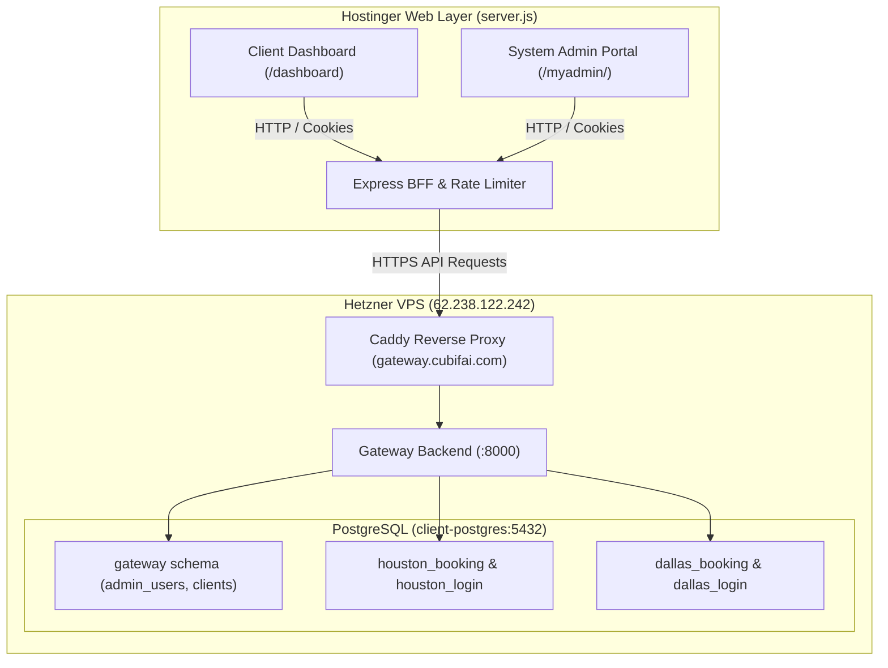

# CubifAI Dental Practice CRM & Multi-Tenant Management Dashboard

A lightweight, enterprise-grade Node.js Express CRM backend and dashboard for dental practice management. Designed with a dual-plane architecture that provides tenant isolation, real-time appointment booking management, administrative controls, and secure multi-tenant PostgreSQL schema isolation alongside integrations with the external Gateway API (`https://gateway.cubifai.com`).

---

## Architecture Overview

The system operates across two decoupled planes:

1. **Hostinger Web Application Layer (Frontend & BFF)**:
   - Serves the Client Portal (`/` or `/dashboard`) and System Admin Portal (`/myadmin/`).
   - Manages encrypted `HttpOnly`, `SameSite=Lax`, and HTTPS `Secure` JWT session cookies (`user_session`, `admin_session`).
   - Delegates tenant authentication, bookings, analytics, and tenant provisioning to the Gateway API via `GATEWAY_API_URL`.
   - Requires zero database exposure in production.

2. **VPS Gateway & Multi-Tenant Control Plane (`n8n.cubifai.com` / Hetzner VPS)**:
   - **Control Plane (`gateway` schema)**: Manages admin accounts (`gateway.admin_users`) and global client registry (`gateway.clients`).
   - **Client Plane (`<client>_booking` & `<client>_login` schemas)**: Completely isolated PostgreSQL schemas per dental clinic.
   - **Service Roles**:
     - `gateway_user`: Master gateway engine backend service account.
     - `client_viewer`: Dedicated read-only PostgreSQL role for queries and provisioning audits (`9876@ClientViewer`).



---

## Key Features

- **Exclusive Admin Routing**: System admin panel is strictly routed through `/myadmin/`. Legacy `/admin` and `/kami` routes are permanently disabled (`404 Not Found`).
- **Dynamic Database-Driven Admin Auth**: Admin accounts are stored in and strictly verified against `gateway.admin_users`. No hardcoded credentials.
- **Strict Multi-Tenant Schema Separation**: Every dental clinic operates in its own PostgreSQL schema pair (`<slug>_booking`, `<slug>_login`). Practice A cannot view Practice B's appointments.
- **Single Staff Credential Enforcement**: Each dental organization enforces strictly one active staff credential in both PostgreSQL and the Control Plane.
- **Rate Limiting Protection**: Public authentication routes (`/api/admin/login`, `/api/user/login`, `/api/auth/link`) are protected with IP-based rate limiting.
- **Custom Practice Branding**: High-resolution branded assets for Client Dashboard (`static/logo-client.png`) and Admin CRM (`static/logo.png`).

---

## Environment Configuration

### Production (Option A - Recommended for Hostinger)

In production on Hostinger, the web application only requires 4 variables because all database traffic is securely proxied through the Gateway API:

```env
PORT=8000
GATEWAY_API_URL=https://gateway.cubifai.com
SESSION_SECRET=super-secret-hostinger-session-key-2026
NODE_ENV=production
```

| Key | Value | Purpose |
| :--- | :--- | :--- |
| `PORT` | `8000` | Application listener port. |
| `GATEWAY_API_URL` | `https://gateway.cubifai.com` | Live Hetzner VPS Gateway proxy endpoint. |
| `SESSION_SECRET` | `super-secret-hostinger-session-key-2026` | Cryptographic key used to seal session cookies. |
| `NODE_ENV` | `production` | Enforces HTTPS `Secure`, `HttpOnly`, and `SameSite=Lax` cookies. |

---

## Local Development & Testing

### 1. Install Dependencies
```bash
npm install
```

### 2. Configure Environment
Copy `.env.example` to `.env`:
```bash
cp .env.example .env
```

### 3. Start Local Server
- **Development** (with auto-reload):
  ```bash
  npm run dev
  ```
- **Production Mode**:
  ```bash
  npm start
  ```

---

## Hostinger Deployment Guide

1. In Hostinger hPanel, navigate to **Cloud / Node.js Applications** &rarr; **Settings and redeploy**.
2. **Build Configuration**:
   - **Framework preset**: `Express`
   - **Node version**: `18.x` or `20.x`
   - **Root directory**: `./`
   - **Package manager**: `npm`
   - **Entry file**: `server.js`
3. **Environment Variables**:
   Click **Import .env** and paste the 4 production environment variables.
4. **Deploy**:
   Upload `Deploy.zip` and click **Deploy**. Hostinger will run `npm install` and start `server.js`.

---

## Default Verified Credentials

- **System Administrator Portal** (`/myadmin/`):
  - **Username**: `kami`
  - **Password**: `9876@Kami`
- **Sample Client Dashboard** (`/login` or Modal):
  - **Organization Slug**: `houston`
  - **Username**: `user@gmail.com`
  - **Password**: `12344`

---

## Project Structure

```
dental-dashboard/
├── .agent/                 # AI engineering context, ADRs, architecture docs, and tasks
│   ├── architecture/       # Detailed system design documents
│   ├── decisions/          # Architecture Decision Records (ADR-001, ADR-002)
│   └── tasks/              # Task logs and specifications
├── db/                     # SQL schemas and database pool manager
│   ├── client_plane_schema.sql
│   ├── control_plane_schema.sql
│   └── db_manager.js
├── resources/              # High-resolution branding vector assets
├── scripts/                # Provisioning and database maintenance scripts
│   └── provision_client.js
├── static/                 # Frontend assets (HTML5, Vanilla JS, CSS)
│   ├── admin.html          # Admin CRM Portal
│   ├── admin.js            # Admin CRM logic
│   ├── index.html          # Client Dashboard
│   ├── script.js           # Client Dashboard logic
│   ├── login.html          # Unified Client / Admin sign-in portal
│   ├── logo.png            # Admin CRM logo
│   └── logo-client.png     # Client Dashboard logo
├── AGENTS.md               # Repository rules and engineering constraints
├── package.json            # Node.js dependencies and run scripts
├── README.md               # Project documentation
└── server.js               # Express application and Gateway API proxy
```
